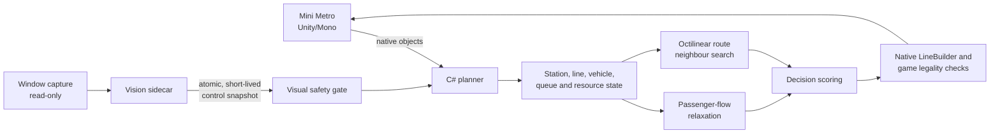
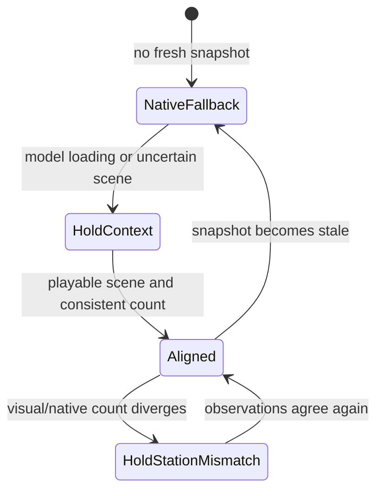

# Mini Metro AI Planner

An unofficial, research-oriented autopilot for **Mini Metro** that combines native Unity game state, deterministic route search, passenger-flow optimization, resource allocation, and an optional TensorFlow/PyTorch computer-vision safety sidecar.

> [!IMPORTANT]
> This project is not affiliated with or endorsed by Dinosaur Polo Club. You must own Mini Metro. No game binaries, decompiled game source, screenshots, saves, datasets, or commercial assets are included in this repository.

## What this project contains

- A C# planner for Classic and Extreme modes.
- A small Mono.Cecil patcher that injects one planner entry point into the locally installed game assembly.
- Deterministic octilinear route-neighbour search.
- A minimum-cost passenger-flow relaxation used by topology and upgrade decisions.
- Capacity, congestion, transfer, interchange, crossing, and challenge-aware heuristics.
- A read-only vision sidecar with classical OpenCV/NumPy and trained PyTorch runtime backends.
- TensorFlow/KerasCV and PyTorch/torchvision Colab experiments for scene classification and station detection.
- Dataset auditing, model-bundle validation, runtime telemetry, and regression tooling.

## Architecture



The C# plugin is the sole action executor. Vision can hold a suspicious topology change, but it cannot draw lines, allocate assets, or send input.

See [docs/ARCHITECTURE.md](docs/ARCHITECTURE.md) for the decision pipeline and failure modes in detail.

## Decision engine

### Authoritative native state

The planner reads the live `Game`, `City`, `Station`, `Line`, vehicle, carriage, upgrade, and crossing-resource objects. It monitors:

- station queues, capacity, overload timers, expiry risk, service ETA, centrality, and shape demand;
- line length, route shape diversity, locomotives, carriages, onboard passengers, occupancy, speed, headway, turnaround time, and crossings;
- spare lines, locomotives, carriages, tunnels/bridges, and interchanges;
- Classic unlock constraints, daily challenges, and Extreme-mode irreversibility.

### Octilinear route search

Mini Metro tracks are represented more faithfully by one diagonal leg plus one orthogonal leg than by Euclidean distance. New-line planning ranks a bounded, deterministic neighbourhood of two- and three-station routes drawn from high-priority unconnected stations and existing transfer hubs. Once a network exists, a new route must attach to it.

The quick score rewards demand coverage and shape diversity, penalizes repeated shapes and track length, rejects known crossing-blocked edges, and sends the best candidates to the passenger-flow model.

### Passenger-flow relaxation

Stations are graph nodes and adjacent route segments are weighted edges. Edge costs account for octilinear distance, trains, carriages, route length, and queue pressure. Floyd-Warshall computes deterministic all-pairs costs; queued demand is assigned to the cheapest reachable station of each requested shape.

The planner minimizes:

```text
objective = average_travel_cost
          + 1200 * unreachable_demand_ratio
          + 35 * congestion_penalty

flow_gain = current_objective - candidate_objective
```

`flow_gain` influences new lines, extensions, transfers, station rehoming, and weekly upgrade choices. Session logs expose `flow=[cost,unreach,cong]`, `flowGain`, and `octileLength` for auditability.

### Capacity and topology control

- Adds trains and carriages using marginal capacity benefit.
- Builds relief lines while reserving enough rolling stock to run them.
- Adds transfers only after connectivity, unique-shape coverage, pressure, distance, and existing-transfer checks.
- Re-evaluates transfer and asset-move effects, applies cooldowns, and rolls back harmful reversible moves.
- Rehomes stations and removes fully redundant low-load lines only in reversible modes.
- Never removes Extreme-mode routes.
- Freezes only the exact edge that failed due to a missing bridge/tunnel, allowing other legal work to continue.
- Allocates, moves, or recovers interchanges with global and reverse-move cooldowns.

## Visual decision control

The optional sidecar observes the Mini Metro client area and publishes an atomic state file. Its state machine is intentionally conservative:



- `Aligned`: normal planner operation.
- `HoldContext`: pauses irreversible topology edits while the scene is uncertain or models are loading.
- `HoldStationMismatch`: pauses topology edits when visual and native station counts disagree beyond a dynamic tolerance.
- `NativeFallback`: uses native state when the sidecar is missing, disabled, invalid, or stale.

During PyTorch initialization, a `model_loading` heartbeat is published every 0.75 seconds so the snapshot cannot expire into an early topology action. Emergency native capacity relief remains available for genuinely critical stations.

## Machine-learning research

The repository includes all training, evaluation, packaging, activation, and runtime inference code. Generated datasets and weights are deliberately excluded.

| Task | TensorFlow experiment | PyTorch experiment | Pretraining |
| --- | --- | --- | --- |
| Scene classification | MobileNetV3Small / EfficientNetV2B0 | MobileNetV3 Small / EfficientNet-B0 | ImageNet |
| Station detection | KerasCV YOLOv8-XS / YOLOv8-S | Faster R-CNN MobileNetV3 320 / large FPN | COCO |

The six scene classes cover gameplay and non-gameplay contexts. Station detection is intentionally binary because the runtime gate consumes station presence, count, and confidence; shape recognition remains an offline diagnostic.

### Recorded lightweight baselines

| Model | Primary held-out result | Status |
| --- | ---: | --- |
| TensorFlow MobileNetV3Small scene classifier | macro-F1 0.9111 | Research only |
| PyTorch MobileNetV3 Small scene classifier | macro-F1 0.8545 | Research only |
| TensorFlow/KerasCV YOLOv8-XS detector | F1@0.5 0.7645, count MAE 4.2 | Research only |
| PyTorch Faster R-CNN MBv3 320 detector | F1@0.5 0.9069, count MAE 0.8 | Research only |

Neither trained bundle met the production promotion gates. The tested machine used an explicit, auditable `allow_unpromoted` override for the PyTorch pair; this never changes formal promotion status or weakens the C# safety gate.

## Repository layout

```text
src/MiniMetroExtremePlanner/          C# decision engine and visual-control bridge
src/MiniMetroExtremePlannerPatcher/   local Mono.Cecil patcher
research/vision/mini_metro_vision/    dataset, CV, runtime, and control code
research/vision/colab/                Colab notebooks and TF/PyTorch experiments
research/vision/tests/                vision tests
tools/                                log regression analyzer and tests
docs/                                 architecture and publication notes
*.ps1                                 build, install, verify, and smoke-test scripts
```

## Requirements

### Planner

- Windows
- A legally installed current copy of Mini Metro from Steam
- Windows PowerShell 5.1 or PowerShell 7
- .NET Framework 4.x C# compiler
- Mono.Cecil compatible with the patcher

The scripts never download or redistribute game assemblies. They compile against files in your own Mini Metro installation.

### Vision research

- Python 3.10+
- NumPy, OpenCV, Pillow, MSS
- Optional PyTorch/torchvision for trained runtime inference
- Google Colab GPU recommended for TensorFlow/PyTorch training

## Build and install

The current scripts accept an explicit game directory. The local default reflects the development machine, so public users should always pass their own path:

```powershell
$game = 'C:\Program Files (x86)\Steam\steamapps\common\Mini Metro'
.\build.ps1 -GameDir $game
.\verify.ps1 -GameDir $game
.\install.ps1 -GameDir $game
```

`build.ps1` reads Mono.Cecil from `-CecilPath`, the `MONO_CECIL_PATH` environment variable, or a sibling `.tools\Mono.Cecil.dll` fallback. It writes compiled output to ignored `dist/` and `staging/` directories, creates a SHA-256 build manifest, and verifies the injected entry point. Installation backs up the original assembly locally and refuses to overwrite a game build that changed after compilation.

Uninstall with:

```powershell
.\uninstall.ps1 -GameDir $game
```

Steam updates can change internal APIs. Rebuild and re-run verification after every update.

## Vision setup and commands

```powershell
cd .\research\vision
.\setup.ps1
.\run.ps1 --archive C:\path\to\your\labelled-data.zip audit
.\run.ps1 --archive C:\path\to\your\labelled-data.zip train-context
.\run.ps1 --archive C:\path\to\your\labelled-data.zip evaluate
```

Install trained-runtime dependencies only when needed:

```powershell
.\setup.ps1 -TrainedModels
.\run.ps1 validate-model-bundle C:\path\to\bundle.zip
.\run.ps1 activate-model-bundle C:\path\to\bundle --allow-unpromoted
.\run.ps1 model-status
```

Observe without sending input:

```powershell
.\run.ps1 watch --seconds 60 --raw-dir .\artifacts\raw
.\run.ps1 control --seconds 3600 --interval 1
```

See [research/vision/README.md](research/vision/README.md) and [research/vision/colab/README.md](research/vision/colab/README.md).

## Colab workflow

1. Build or provide a rights-cleared dataset archive.
2. Run `01_dataset_audit.ipynb`.
3. Run `02_tensorflow_experiments.ipynb` and/or `03_pytorch_experiments.ipynb` on a GPU runtime.
4. Download the generated model bundle with config, history, metrics, native weights, and a SHA-256 manifest.
5. Validate it locally. Promotion additionally requires all metric gates and three independent current-build sessions.

Set `RUN_FULL_SWEEP=True` in the training notebooks to run all eight model configurations.

## Verification

Python-only checks:

```powershell
python -m unittest -v .\tools\test_analyze_player_log.py
cd .\research\vision
python -m unittest discover -s .\tests -v
python .\colab\validate_notebooks.py
```

Full local verification with a game installation:

```powershell
.\verify.ps1 -GameDir $game
.\runtime-smoke.ps1 -GameDir $game -TimeoutSeconds 120 -MinimumActions 5
```

The visual smoke test additionally injects a deliberate station-count mismatch, requires the planner to hold, launches the real observer, and asserts that the first planner action occurs after the first `Aligned` state.

## Data and model policy

This source repository intentionally excludes:

- Mini Metro binaries and assets;
- decompiled game source;
- screenshots and labelled datasets;
- save/profile data and runtime logs;
- generated patches and compiled executables;
- trained weights and model output archives.

Code can be open source while inputs and learned artifacts have different rights. Contributors must document provenance and redistribution permission before publishing any dataset or weight release.

## Provenance

The frame/buffer/pipeline separation is inspired by SerpentAI, and the historical labelled-data format comes from an earlier MIT-licensed Mini Metro experiment. Solver concepts were independently reimplemented from historical route-search and minimum-cost-flow prototypes. See [MERGE_DECISIONS.md](MERGE_DECISIONS.md) and [research/vision/THIRD_PARTY_NOTICES.md](research/vision/THIRD_PARTY_NOTICES.md).

## License

Project-authored source code and documentation are released under the [MIT License](LICENSE). Mini Metro, its code, artwork, and trademarks remain the property of their respective owners.
