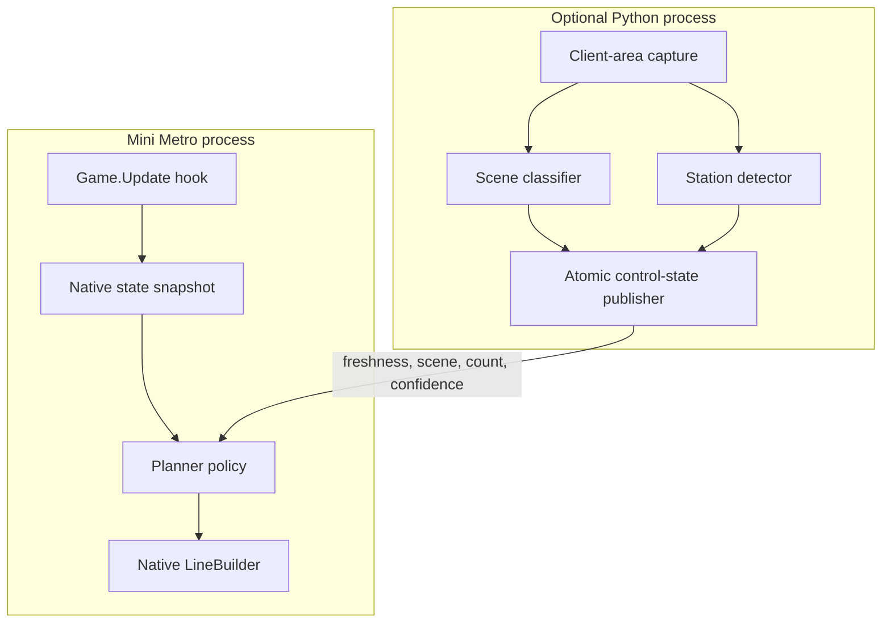
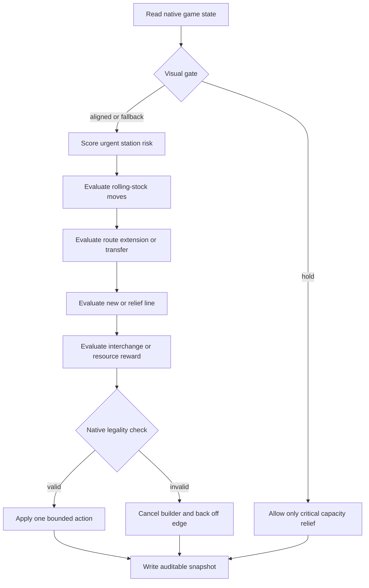
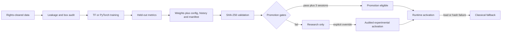

# Architecture and Decision Model

## Design goals

The planner is designed around four constraints:

1. **Native state is authoritative.** Visual inference may be useful, but it must not replace exact game objects when those objects are available.
2. **Every action remains legal.** Route changes are submitted through the game's own builder and checked against mode-specific restrictions.
3. **Online decisions are deterministic and bounded.** The game loop cannot wait for unbounded search or stochastic optimization.
4. **Research components fail safely.** Missing models, stale snapshots, and domain drift must reduce visual authority, not increase it.

## Runtime components



The assembly patch is intentionally narrow: it adds one planner call to the existing update method. Planner logic stays in a separate DLL, while generated binaries stay outside version control.

## Decision cycle



Only one bounded action is committed per decision tick. Cooldowns and post-action evaluations prevent oscillation.

## Passenger-flow model

For `N` active stations, the optimizer builds an `N x N` cost matrix. Existing shared-line service produces edges whose costs reflect geometry and available capacity. A hypothetical route contributes candidate edges. Floyd-Warshall computes all-pairs shortest costs; each queued demand unit is assigned to the cheapest reachable destination with the requested symbol.

This is a deterministic minimum-cost passenger-flow relaxation, not a full capacitated multi-commodity optimizer. It is deliberately small enough for the live game loop.

The objective is:

```text
J = C_avg + 1200 U + 35 P
```

Where:

- `C_avg` is demand-weighted average reachable cost;
- `U` is the ratio of unreachable demand;
- `P` is mean congestion/over-capacity penalty.

Candidate benefit is `J_before - J_after`. Positive values improve the modeled network.

## Route neighbourhood

The route generator selects at most five unconnected candidates and four existing hubs. It enumerates ordered pairs and triples, rejects duplicates and blocked edges, applies a fast geometry/shape/demand score, and runs full flow evaluation on at most the best sixteen candidates.

This bound makes complexity predictable while preserving the useful structure of neighbourhood search. Stochastic simulated annealing from historical experiments is intentionally excluded from runtime decisions.

## Visual gate protocol

The sidecar writes a versioned key/value snapshot through a temporary file followed by atomic replacement. A snapshot carries capture time, sequence, context, confidence, station count, detector confidence, backend, and an enforcement flag.

The plugin checks:

1. schema and parse validity;
2. whether control is enabled;
3. freshness (six-second maximum age);
4. gameplay-context confidence;
5. detector confidence;
6. visual/native station-count tolerance.

Invalid or stale data enters `NativeFallback`. Confident non-gameplay/model-loading state enters `HoldContext`. A large count disagreement enters `HoldStationMismatch`. Neither hold state grants the sidecar action authority.

## Model lifecycle



Integrity validation and production promotion are separate. A bundle can be internally intact while still failing quality gates.

## Failure containment

- A patch is built only against the user's local game assembly.
- Installation records hashes and refuses to overwrite a changed game build.
- Failed route edits are canceled through the native builder.
- Crossing failures back off only the exact edge that failed.
- Reversible asset moves are measured and can be rolled back.
- Vision initialization publishes a hold heartbeat to close the model-loading freshness gap.
- Stopping the sidecar eventually restores native-only planning.

